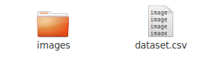
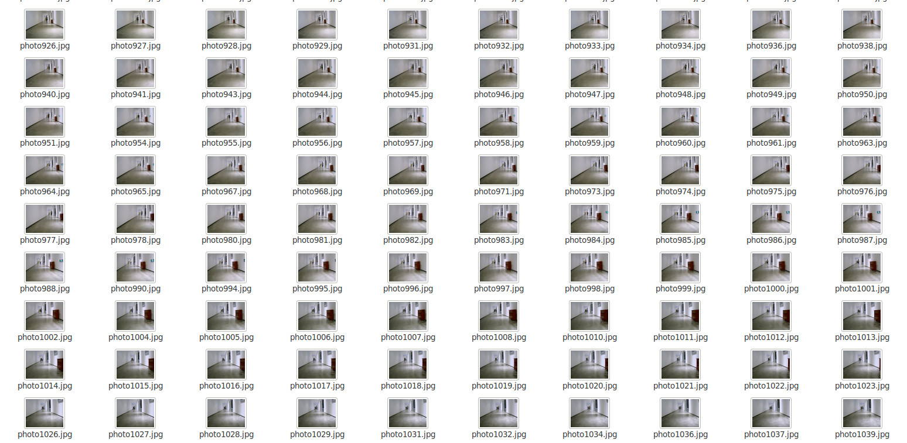
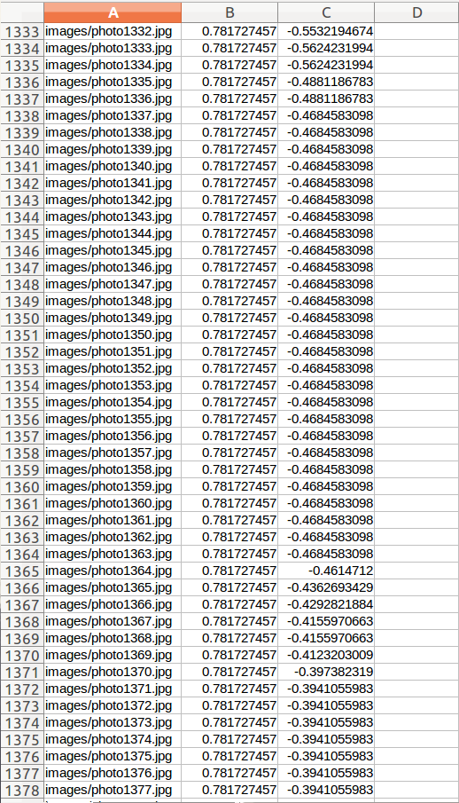
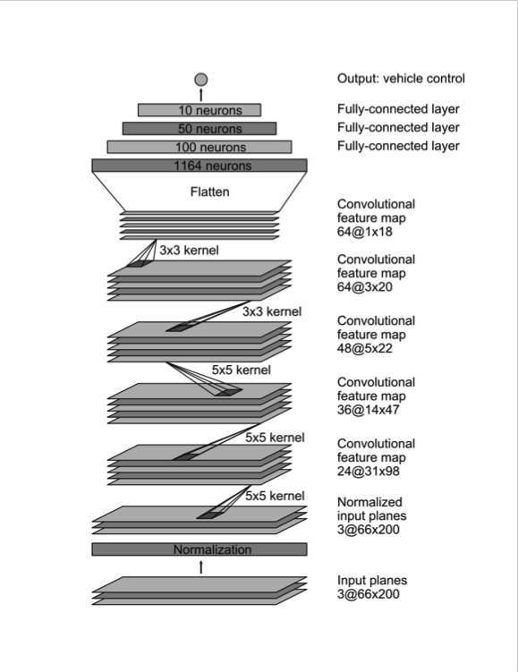
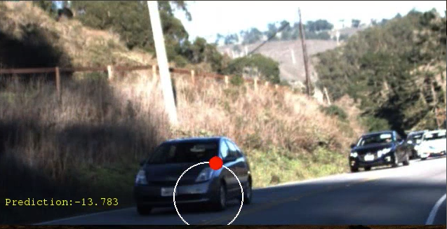

# Britshort Wiki

## ABOUT THIS DOCUMENT

This document is to help you setting up Britshort and applying your own algorithm. 

## OVERVIEW OF COMPONENTS

Britshort contains two parts:

- Hardware:
	- TurtleBot
	- GPU
	- Kinect
	- RPLIDAR
	- USB Camera
	- Xbox One Controller

- Software:
	
	- 2-hour driving dataset 
	- runner.py
	- SteeringNode.py
	- model.py
	- rocord_data.py
	- utils.py
	- Self-Driving Car Simulator 

## HOW TO USE

**IMPORTANT: Make sure you can access those 404-not-found websites in terminal.**

### Prepare Your Environments 

#### Operating System
Ubuntu 14.04 LTS is recommended. Either in VM or physical machine is fine. 

Quick Guide of [Installing Ubuntu from a USB memory stick](https://help.ubuntu.com/community/Installation/FromUSBStickQuick) 

~~~
sudo apt-get update
sudo apt-get upgrade
sudo apt-get install build-essential cmake g++ gfortran git vim pkg-config python-dev software-properties-common wget
sudo apt-get autoremove
sudo rm -rf /var/lib/apt/lists/*
~~~

From the terminal, run the following commands to update packages and install some essential software:

#### Set Up Robot Operating System (ROS) 

##### Install ROS
To play with our robots, ROS Indigo Igloo will be your best partner. Install ROS Indigo on your machine.  See installation instructions [here](http://wiki.ros.org/indigo/Installation/Ubuntu). 

Besides, prepare your self with basic knowledge of ROS, the [Beginner Level of Core ROS Tutorials](http://wiki.ros.org/ROS/Tutorials) is a good start. 

##### Set Up Turtlebot Software
After installing the ros-indigo-desktop-full, you'll need to install the following debs for TurtleBot. 

~~~
sudo apt-get install ros-indigo-turtlebot ros-indigo-turtlebot-apps ros-indigo-turtlebot-interactions ros-indigo-turtlebot-simulator ros-indigo-kobuki-ftdi ros-indigo-rocon-remocon ros-indigo-rocon-qt-library ros-indigo-ar-track-alvar-msgs
~~~

##### Enable USB cameras on your machine[1]:

See instructions [here](http://ros-robotics.blogspot.com/2015/06/webcam-on-ros.html)

##### Install Driver for XBOX ONE Controller 

See GitHub links [here](https://github.com/paroj/xpad)

#### Set Up a Deep Learning Ready Environment 

##### If you're using GPU

- GPU:
	*The following part of document is pretty much based on ref [2].*
	
	A CUDA capable GPU is highly preferred to work on deep learning projects. We are using a NVIDIA GTX1080 GPU and it works just amazing. 
	
	If you're using GPU, you will need to download the correct driver based on your GPU model. Check with this : 
	
	`lspci | grep -I nvidia`
	
	You can heck the Proprietary GPU Drivers PPA repository to find the current release for your GPU.  However it's recommended to go with the 375.66 — the current long-lived branch release. Install the driver with the following commands:
	
	~~~
	sudo add-apt-repository ppa:graphics-drivers/ppa
sudo apt-get update
sudo apt-get install nvidia-375
	~~~
	
	Then restart your computer:
	`sudo shutdown -r now`
	To double check that the driver has installed correctly:
	`cat /proc/driver/nvidia/version	`

- CUDA

	Download the CUDA 8.0 toolkit from Nvidia’s site. Go to the Downloads directory (or where ever you chose to save it) and install CUDA:
	
	~~~
	sudo dpkg -I cuda-repo-ubuntu1604*amd64.deb
	sudo apt-get update
	sudo apt-get install cuda
	~~~
	
	Add CUDA to the environment variables:
	
	~~~
	echo 'export PATH=/usr/local/cuda/bin:$PATH' >> ~/.bashrc
	echo 'export LD_LIBRARY_PATH=/usr/local/cuda/lib64:$LD_LIBRARY_PATH' >> ~/.bashrc
	source ~/.bashrc
	~~~
	
	Check that the correct version of CUDA is installed:
	
	`nvcc -V`
	
	Restart your computer:
	
	`sudo shutdown -r now`
	
- cuDNN

	Download the cuDNN library from [Nvidia’s site](https://developer.nvidia.com/cudnn). You will need to first sign up for Nvidia’s developer program before you can download cuDNN. They state that this could take up to a couple of days, but I received access almost instantly. At the time of this writing, cuDNN v5.1 is the version officially supported by TensorFlow, so hold off on v6.0 unless you know it is supported (they are currently working on it). After downloading, go to your Downloads directory to extract and copy the files:
	
	~~~
	tar xvf cudnn*.tgz
	cd cuda
	sudo cp -P */*.h /usr/local/cuda/include/
	sudo cp -P */libcudnn* /usr/local/cuda/lib64/
	sudo chmod a+r /usr/local/cuda/lib64/libcudnn*
	~~~
	
##### Libraries and Dependences 

The mainly deep learning tools we'll use are TensorFlow and Keras. But you'll need more than these.
If you're not using GPU, replace`sudo pip install tensorflow-gpu==1.1` with sudo pip install tensorflow==1.1
	
	sudo apt-get install build-essential gfortran libatlas-base-dev python-pip python-dev	 
	sudo pip install --upgrade pip
	sudo pip install numpy scipy matplotlib pandas tensorflow-gpu==0.12.1 keras==1.2 h5py scikit-image jupyter matplotlib imageio pygame

	sudo pip install -U scikit-learn
	

### Build your first self-driving car in simulator

### Make Britshort a brilliant driver

#### Bring up turtlebot
- Connect turtlebot, usb camera, xbox one controller (optional) to your laptop. 
- Include ros workspaces.
`source /opt/ros/indigo/setup.zsh;source /home/ferrycake/ros_ws/devel/setup.zsh` 
	PS: if you're using bash, then replace all the "zsh" to "bash"
	
- Bring up: `roslaunch turtlebot_bringup minimal.launch`
- Open camera: `roslaunch usb_cam usb_cam-test.launch`
	PS: Remember to check your camera's ID. Typically, the built-in camera in your laptop is /dev/video0, the external usb camera is /dev/video1. To change which camera to use: 
	
	~~~
	roscd usb_cam/launch/
	vi usb_cam-test.launch
	~~~
	Then you change the params such like device id and resolution. The default id is dev/video0 and the resolution is 320 x 240. 
	
#### Collect dataset
You can collect dataset either by downloading from Comma.ai [link](https://github.com/commaai/research) or by collecting dataset yourself. 

We have written a script to help you collect your own dataset by driving turtlebot with Xbox One Controller. 

In terminal, cd to *SDR/scripts/* run:

`python record_dataset.py`

Now start driving. The script will record a image from camera and the corresponding steering command (in Twist format) every 0.05 second. 

When you end the program (by typing control+C), the script will save all the data in to a folder named dataset. The dataset will contain two parts: The **images** folder which holds all the raw images collected. The dataset.csv contains the path to those images (the first column),  corresponding speed (the second column) and steering angle (the third column). 

**Under /dataset/ :**

**Under /images/ :**

**dataset.csv:**

####  Train your model

In *SDR/*,  run:

`python model_SDR.py `

this will begin training your model using TensorFlow and Keras.   The network is built based on Nvidia's paper. 

The network consists of 9 layers, including a normalization layer, 5 convolutional layers and 3 fully connected layers. The input image is split into YUV planes and passed to the network. 

    Convolution: 5x5, filter: 24, strides: 2x2, activation: ELU
    Convolution: 5x5, filter: 36, strides: 2x2, activation: ELU
    Convolution: 5x5, filter: 48, strides: 2x2, activation: ELU
    Convolution: 3x3, filter: 64, strides: 1x1, activation: ELU
    Convolution: 3x3, filter: 64, strides: 1x1, activation: ELU
    Drop out (0.5)
    Fully connected: neurons: 100, activation: ELU
    Fully connected: neurons: 50, activation: ELU
    Fully connected: neurons: 10, activation: ELU
    Fully connected: neurons: 1 (output)

#### Evaluation 
You can evaluate the result in 3 ways. 

- The Keras will report validation result once the training is done.
- Visualizing the predictions on test dataset to a steering wheel. 
	
	
	To visualize your predictions, first you need to predict angles on test dataset, then save the predictions to a csv file. cd to *SDR/scripts/*. Let's say you have put your test dataset in *SDR/scripts/test_dataset/* as the same structure as the *dataset* folder. Run:
	
	`python save_predict.py`
	
	This script will make predictions to all the images in test dataset and save them to a .csv file named predict.csv in test_dataset folder. 
	
	Now you are ready to visualize the test result as a video. in *SDR/*, run:
	
	`python visualize_own.py`
	
- You can also just test on a real road. Connect your laptop to turtlebot and bring up as instructions above, in *SDR/scripts/*, run:

	`python runner.py`
	
	You robot should now drive itself freely on the road. 
	
#### Running with pre-trained model

Instead of training a model from scratch, our robot can also drive with a pre-trained model. Here's a pre-trained model by [Chauffeur](https://github.com/udacity/self-driving-car/tree/master/steering-models/evaluation), winner of Udacity's challenge 2. They have trained their model on hours of real [driving dataset](https://github.com/udacity/self-driving-car/tree/master/datasets/CH2) provided by Udacity. The models files are cnn.json, cnn.weights, lstm.json, lstm.weights. 

To run with pre-trained model, connect to ROS robot, bring up roscore, open camera, then run:

`python prerunner.py`

Check out this quick demo on Youtube. 
		

## Ref
[1]: [Webcam on ROS](http://ros-robotics.blogspot.com/2015/06/webcam-on-ros.html), Roel Noort  
[2]: [Ubuntu + Deep Learning Software Installation Guide ](https://medium.com/towards-data-science/ubuntu-deep-learning-software-installation-guide-fdae09f79903), Nick Condo